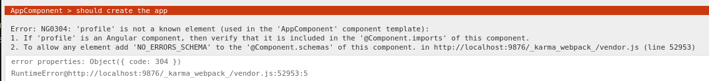

Have you ever been working on an Angular project and you are running tests and you get the following error:

This error is Angular telling you that for that specific test, it found an element in the template that it doesn't know about. Instead of trying to render the element, it throws an error.  This error is due to the test module setup not including an import for that component or module that contains the unknown element.

For the example error above, this is what my `app.component.html` file looks like (parts removed for brevity)
```html
<h1>Hello, {{ title }}</h1>
<p>Congratulations! Your app is running. 🎉</p>
<profile></profile>
```
`<profile>` is another Angular component that I have created to contain some other functionality.  When the application runs, angular knows about this element due to it being registered to the main application. But the test module does not know about it so we get the error!

Here is what my `app.component.spec.ts` file looks like (again, parts removed for brevity)
```typescript
describe('AppComponent', () => {
  beforeEach(async () => {
    await TestBed.configureTestingModule({
      imports: [AppComponent],
    }).compileComponents();
  });
```

Typically you would fix this error by adding the component or module to the tests `TestBed.configureTestingModule` setup like so
```typescript
describe('AppComponent', () => {
  beforeEach(async () => {
    await TestBed.configureTestingModule({
      imports: [AppComponent, ProfileComponent],
    }).compileComponents();
  });
```
or if the component lives in another module
```typescript
describe('AppComponent', () => {
  beforeEach(async () => {
    await TestBed.configureTestingModule({
      imports: [AppComponent, ProfileModule],
    }).compileComponents();
  });
```
The main problem with this, is that you need to add an import for every component or module for every component that would be rendered down the render path, not just direct descendants.  So you testing module setup can become massive at times!

I recently found a third option that makes your setup a little cleaner.  Specify `NO_ERRORS_SCHEME` in the test module setup like so
```typescript
describe('AppComponent', () => {
  beforeEach(async () => {
    await TestBed.configureTestingModule({
      imports: [AppComponent],
      schemas: [NO_ERRORS_SCHEMA],
    }).compileComponents();
  });
```
So what is `NO_ERRORS_SCHEMA` doing here? Well if we look at the [API documentation](https://angular.io/api/core/NO_ERRORS_SCHEMA){.text-blue-600 .dark:text-blue-400} it tells us that
> This schema allows you to ignore the errors related to any unknown elements or properties in a template. The usage of this schema is generally discouraged because it prevents useful validation and may hide real errors in your template. Consider using the CUSTOM_ELEMENTS_SCHEMA instead.

Now when you run your tests, Angular will no longer throw an `...is not a known element` error.  But there is a bit more going on here, when Angular encounters an unknown element, it will render the element as an empty tag and move on.  So it allows you to write `shallow` component tests which is super powerful if you want your tests to only focus on the component in question and not all the child components it utilizes.

Keep in mind that using `NO_ERRORS_SCHEMA` does have some trade-offs as listed in the [Developer Guide](https://angular.io/guide/testing-components-scenarios#no_errors_schema){.text-blue-600 .dark:text-blue-400}. One of those trades-offs is
> The NO_ERRORS_SCHEMA also prevents the compiler from telling you about the missing components and attributes that you omitted inadvertently or misspelled. You could waste hours chasing phantom bugs that the compiler would have caught in an instant.
which could lead to some headaches if you rely on the test framework to validate all your changes.